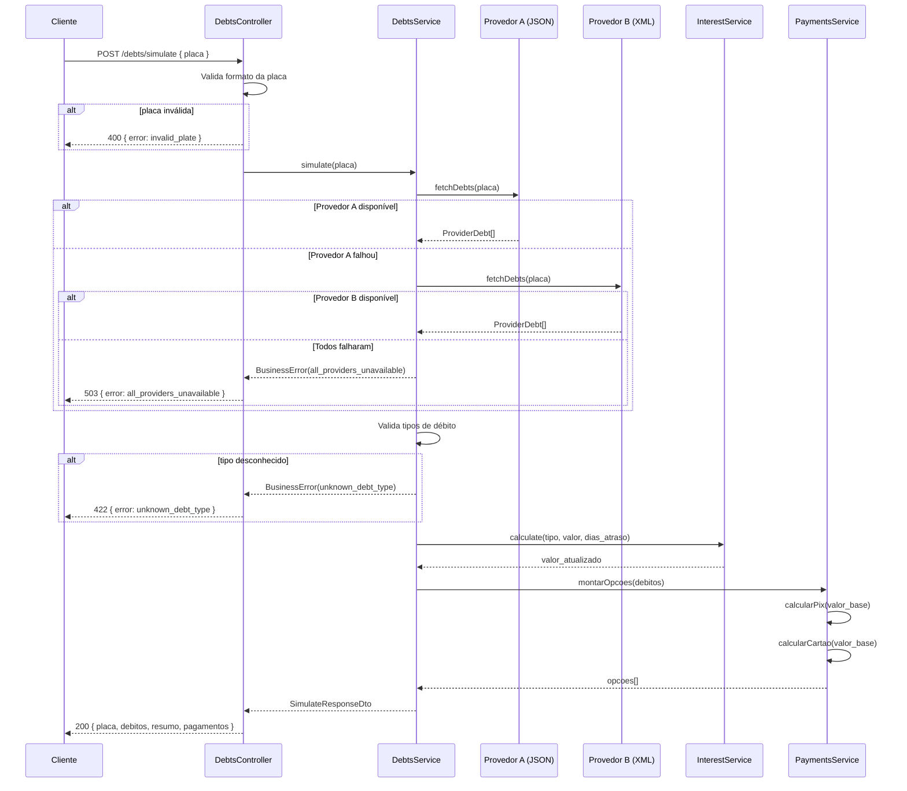
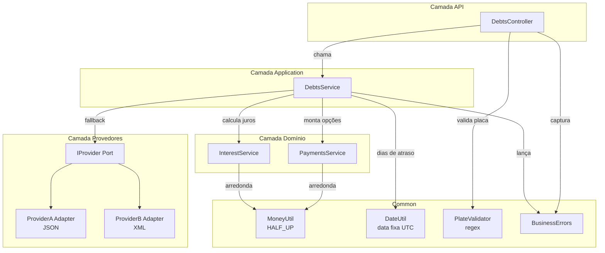

# dok — API de Simulação de Débitos Veiculares

Backend NestJS 10 + TypeScript 5 que consulta provedores de débitos veiculares, aplica regras de juros e retorna opções de pagamento simuladas (PIX e parcelamento no cartão de crédito).

## Visão Geral

O serviço expõe um único endpoint que:

1. Recebe uma placa de veículo brasileira (`placa`).
2. Consulta provedores externos configurados (com fallback automático).
3. Normaliza as respostas dos provedores em um modelo canônico de débito.
4. Calcula os valores atualizados com juros de atraso.
5. Retorna os débitos, um resumo e as opções de pagamento (PIX + cartão).

Consulte [docs/business-rules.md](docs/business-rules.md) para a especificação completa do domínio e [docs/architecture.md](docs/architecture.md) para o design de módulos e camadas.

## Arquitetura

### Fluxo de Requisição



### Módulos e Camadas



## Requisitos

- Node.js 18+
- pnpm 8+

## Instalação

```bash
pnpm install
```

## Execução

```bash
# desenvolvimento (modo watch)
pnpm run start:dev

# produção
pnpm run build
pnpm run start:prod
```

O servidor sobe em `http://localhost:3000` por padrão.

A documentação interativa do Swagger fica disponível em `http://localhost:3000/api`.

## API

### POST /debts/simulate

Simula as opções de pagamento para todos os débitos em atraso de um veículo.

**Requisição**

```json
{ "placa": "ABC1234" }
```

- `placa` deve seguir o formato brasileiro antigo (`AAA0000`) ou Mercosul (`AAA0A00`).
- Placa inválida → HTTP 400 `{ "error": "invalid_plate" }`.
- Todos os provedores indisponíveis → HTTP 503 `{ "error": "all_providers_unavailable" }`.
- Tipo de débito desconhecido retornado por um provedor → HTTP 422 `{ "error": "unknown_debt_type", "type": "<tipo>" }`.

**Resposta (200)**

```json
{
  "placa": "ABC1234",
  "debitos": [
    {
      "tipo": "IPVA",
      "valor_original": "1500.00",
      "valor_atualizado": "1800.00",
      "vencimento": "2024-01-10",
      "dias_atraso": 121
    }
  ],
  "resumo": {
    "total_original": "1800.50",
    "total_atualizado": "2355.93"
  },
  "pagamentos": {
    "opcoes": [
      {
        "tipo": "TOTAL",
        "valor_base": "2355.93",
        "pix": { "total_com_desconto": "2238.13" },
        "cartao_credito": {
          "parcelas": [
            { "quantidade": 1, "valor_parcela": "2355.93" },
            { "quantidade": 6, "valor_parcela": "427.72" },
            { "quantidade": 12, "valor_parcela": "229.67" }
          ]
        }
      },
      {
        "tipo": "SOMENTE_IPVA",
        "valor_base": "1800.00",
        "pix": { "total_com_desconto": "1710.00" },
        "cartao_credito": {
          "parcelas": [
            { "quantidade": 1, "valor_parcela": "1800.00" },
            { "quantidade": 6, "valor_parcela": "326.82" },
            { "quantidade": 12, "valor_parcela": "175.69" }
          ]
        }
      }
    ]
  }
}
```

As opções de pagamento sempre incluem `TOTAL` mais uma entrada `SOMENTE_<TIPO>` por tipo de débito distinto.

## Estrutura do Projeto

```
src/
  debts/          # Domínio — endpoint de simulação, cálculo de juros, DTO
  payments/       # Construtor de opções de pagamento (desconto PIX, PMT cartão)
  providers/      # Porta de provedor + adaptadores (Provedor A: JSON, Provedor B: XML)
  common/         # Utilitários compartilhados (validador de placa, arredondamento, data)
docs/
  business-rules.md   # Regras de negócio canônicas
  architecture.md     # Design de módulos e camadas
```

## Resumo das Regras de Juros

| Tipo de débito | Taxa diária | Teto |
|----------------|-------------|------|
| IPVA | 0,33% | 20% do valor original |
| MULTA | 1,00% | Sem teto |

Os dias de atraso são calculados a partir do vencimento do débito até a data de referência fixa `2024-05-10`. Débitos não vencidos não acumulam juros.

## Documentação da API (Swagger)

Com o servidor rodando, acesse `http://localhost:3000/api` para explorar o endpoint interativamente via Swagger UI.

## Testes

```bash
# testes unitários
pnpm exec jest

# testes e2e
pnpm run test:e2e

# cobertura
pnpm run test:cov
```

## Lint e Formatação

```bash
pnpm run lint
pnpm run format
```

## Considerações de Deploy

### Retry com backoff exponencial

O `retryWithBackoff` opera inteiramente no contexto de cada requisição — sem estado compartilhado. Funciona em qualquer ambiente, incluindo múltiplas réplicas no Kubernetes.

## Melhorias Futuras

### Circuit Breaker distribuído

O `CircuitBreaker` atual mantém estado **em memória dentro do processo**. Isso funciona corretamente para deploys de pod único. Em deploys multi-réplica no Kubernetes, cada pod tem seu próprio estado de circuit breaker, o que significa:

- Um pod pode ter o circuit aberto para o Provedor A enquanto outros pods ainda enviam tráfego para ele.
- Não há coordenação de estado entre réplicas.

Para circuit breaking coordenado em ambientes multi-réplica, considere:

- **Service mesh (recomendado):** Istio ou Linkerd implementam circuit breaking na camada de infraestrutura, transparente para a aplicação.
- **Estado compartilhado:** Armazenar contadores de falhas em Redis com TTL, permitindo que todas as réplicas compartilhem o estado do circuito.
- **Biblioteca distribuída:** `cockatiel` com backend externo, ou soluções como Resilience4j (se migrar para JVM).

### Idempotência de pagamento

O endpoint atual (`POST /debts/simulate`) é uma operação de leitura/cálculo — não executa transações financeiras — e por isso é naturalmente idempotente. Ao evoluir para um endpoint de **pagamento real**, recomenda-se:

- **Header `Idempotency-Key`** (UUID gerado pelo cliente) em `POST /payments/execute`.
- **Cache da resposta** por chave com TTL (ex: Redis por 24 h): requisições repetidas com a mesma chave retornam o resultado já processado sem reexecutar a transação.
- **Locking por chave** para requisições concorrentes com a mesma `Idempotency-Key`.

A arquitetura Ports & Adapters facilita essa evolução: o adapter de pagamento real seria o único ponto a consultar/persistir a chave, sem contaminar o domínio ou a camada de aplicação.
